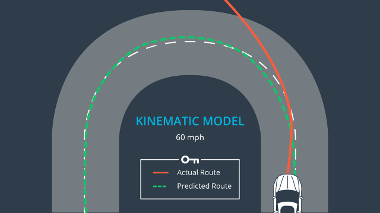
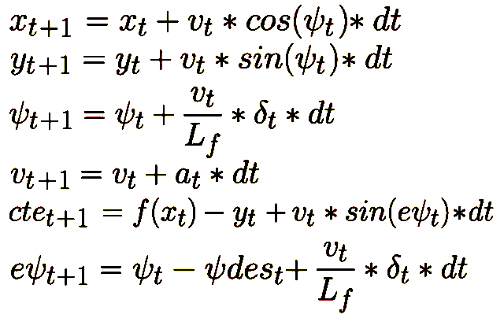

Model Predictive Controller
===


---

### Introduction

Model predictive control (MPC) is an advanced method of process control which I use for driving the car close to optimal path lane in real conditions like actuators delay, noise environment or sensors. MPC is based on iterative, finite-horizon optimization. At time `τ` the current state is sampled and cost minimizing control strategy is computed for relatively short horizon time `[τ, τ+T]`. The MPC has the ability to forecast future events and can take control actions properly. E.g. PID algorithm is deprived of this property.

[Video](https://drive.google.com/file/d/0B90SlGxx-BAeMFV1OFh3Z2UzNkE/view?usp=sharing) how car finishes track successfully using MPC.

### Algorithm description

MPC is multivariable control algorithm. There are decent number of ways to model the car state in the world like _Dynamic Model_ or simpler one _Kinematic model_. The difference between two of these that dynamic model has more parameters and takes into account _longitudinal and lateral forces_, _gravity_, _mass_ and cetera. The kinematic model in turn includes position state variables `x` and `y`, heading angle `ψ` and velocity `υ` and actuators state - acceleration `α` and steering angle `σ`. More information and comparison about these models you can find [here](http://www.me.berkeley.edu/~frborrel/pdfpub/IV_KinematicMPC_jason.pdf). According to the tests provided in this paper _kinematic model_ is not only simpler, but also can surpass dynamic model in some scenarios.

##### Kinematic model:



##### Next state forecasting equations:


The last two terms are cross track error `cte` and heading angle error `eψ`. They define how far the car from planned path and required for effective optimization. The `ψ` and `eψ` equations have `Lf` constant, which is a distance between the front of the vehicle and its gravity centre. `Lf` value varies from car to car, but for _Udacity_ simulation car it equals _2.67_. `dt` stands for timestamp frequency and it must be close to actuators delay, in other words it is time between sent signal to actuators and undertaken action. In my case it equals _100 ms_.

The algorithm itself nails down to following steps executed in `dt`:

1. Convert world coordinates of planned path to car's coordinate system.
2. Fit path polynomial curve.
3. _Optional:_ using coefficients of polynomial calculate `N` points ahead for horizon time interval `T`. I chose `T` equal _1 sec_ and according calculation `N = T / dt`, it turns out that `N` is _10_. These points are predictions where car must be in `t+1, t+2, ..., t+N` steps.
4. Estimate current state values `x`, `y`, `ψ`, `υ`,  including `cte` and `eψ` in accordance with _kinematic model_.
5. Solve non-linear optimization problem with `N * StateSize + (N - 1) * ActuatorsSize` variables and objective function reasoning from _kinematic model_. `StateSize` reflects number of state variables plus number of error variables. `ActuatorsSize` is 2, steer angle and acceleration variables.
6. Correct actuator's values with new computed terms.


##### Parameter tuning

The process of tuning parameters, setting their constrains and boundaries is most tedious and annoying part. For example, the car can't physically turn on 90°, thereafter MPC optimizer had to be guided to bound its output for steering angle. In this project I used `[-0.8, 0.8]` range. This is not only parameter which you have to handcraft. Most difficult ones are weights in objective function and you need to be conscious of what type of weights you modify and why. If you look at out with the tail of eye at `mpc.cpp` source file, you can find list of static variables with `_weight` suffix. I tuned all of them with bare hands. I played with these values a bit and found consistent patterns, some of them I described by comments in source file. Please, double-o this file and weights if you are interested with what values I ended up for _"safe"_ and _"fast"_ driving style of _Udacity_ car in simulator.

### Build instructions

Before you start make sure that you have all installed dependencies:

* [CppAD](https://www.coin-or.org/CppAD/)
* [uWebSockets](https://github.com/uNetworking/uWebSockets)
* [ipopt-3.12.8](https://www.coin-or.org/download/source/Ipopt/). I didn't test this project with other version.

Required:

* _C++11/14_
* _cmake_
* _make_

Build project:

```bash
$ ./build.sh
$ ./run.sh
```

The `build.sh` script builds release binary with optimizations and without debug logging. If you want run debug version, then you need to modify `build.sh` script, replacing build type variable passed to `cmake` with `-DCMAKE_BUILD_TYPE=Debug`.
